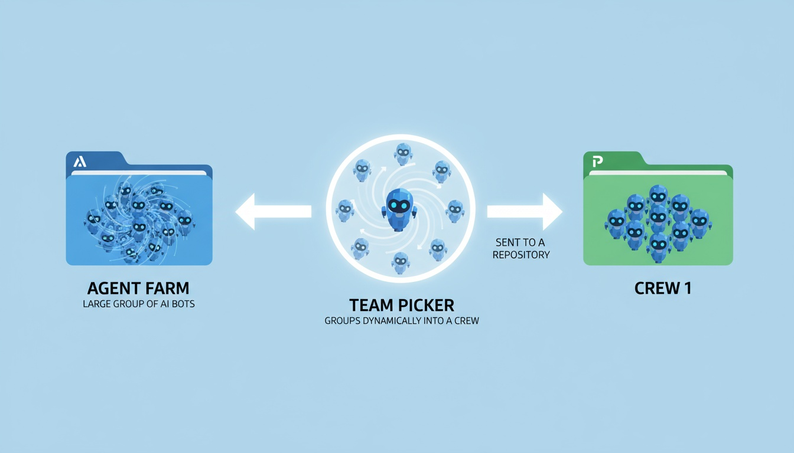
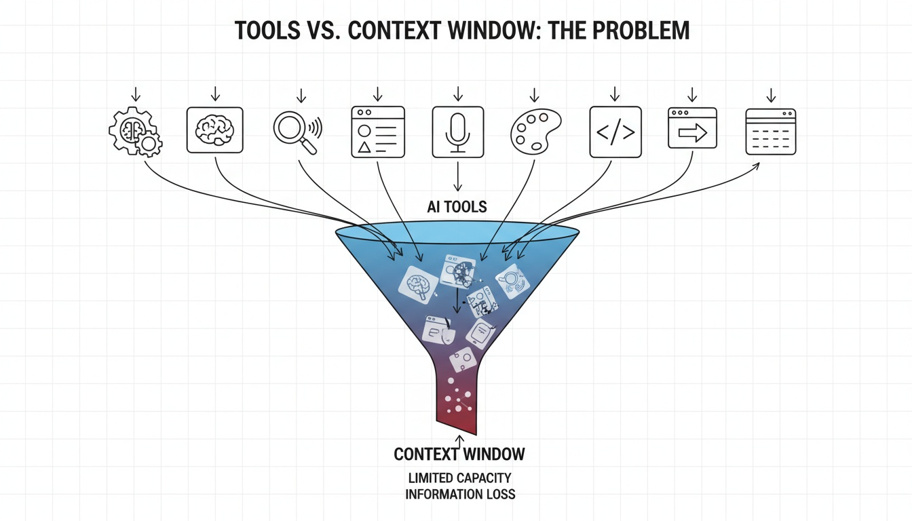
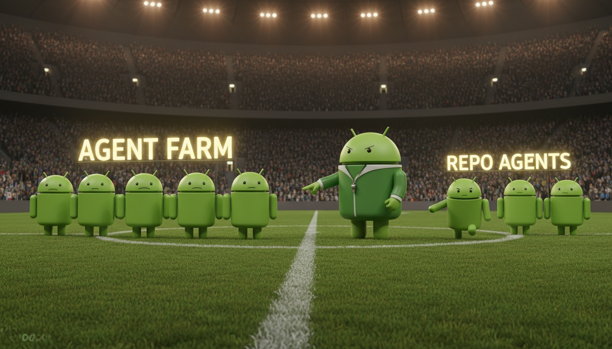
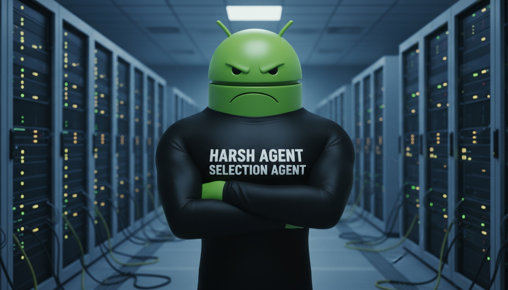
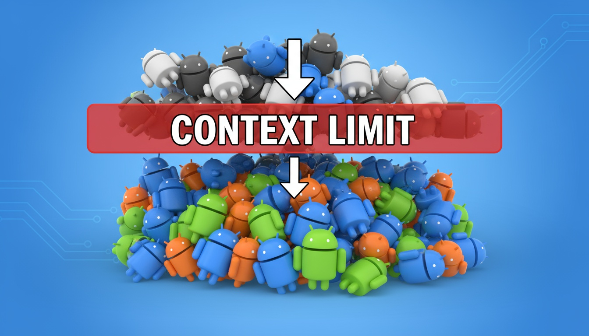

# Claude Agent "Picker" Pattern (Claude Code)

 
Oct / 31 / 2025

## The Problem

Agents have to be used judiciously.

Just like MCP tools.

Too many cooks in the kitchen (and all that).

The actual problem in technical terms: context flooding:

- The more agents, the more descriptions the orchestration agent (plain Claude) has to parse through to figure out which subagent to delegate a task to.
- The more MCP tool definitions Claude has to read... the same thing.

A thought:

If AI tooling progresses faster than context widows grow, this problem can be expected to get more acute and its consequences to be more widely felt. 

Once upon a time, LLMs were envisioned as tools for handling (simple) text. Nowadays, our somewhat fantastical ambition has evolved to that LLMs can maintain good inference while simultaneously dealing with:

- Lots of text (code) 
- Tool definitions (MCP) 
- Agent maps 

Etc. 

## Why Bother With Subagents At All?

Some are strenously against multiagent systems. 

But this quote from the Anthropic docs illustrates why it's worth persevering with working with subagents in spite of this limit:

"Each subagent operates in its own context, preventing pollution of the main conversation and keeping it focused on high-level objectives."

Which is a very big deal when context pollution can flatten out otherwise great inference. 

For creating performant agentic systems, using emerging tooling judiciously has become almost as vital an enterprise as knowing what tooling to use.

Thus, a late night idea for a workaround pattern (even if imperfect, flawed, etc):

---

# The Idea

I call it the agent picker because the first thought I had when writing this was the high school ritual of picking teammates for a game of soccer (was that just my school? It seems awfully callous!).

It offers a hacky workaround because:

- If you add a whole bunch of system level agents ... you get the problem above 
- If you add them at the project level ... the CLI starts warning about the context problem 

At the time of writing, the inner mechanics of agent delegation are opaque. 

---

# The Model

## Agent Farm

Or more accurately the "subagent farm" but that sounds even odder. 

You may go through creative bursts in which you think ... "that would be an amazing subagent." It may have application across multiple Claude workspaces.

This agent may be useful on a personal project and equally helpful on a work project with collaborators. It doesn't matter. What matters is the *idea* and config behind the agent and how it leverages AI to help achieve a project. 

For simplicity, let's sketch the filetree as:

`~/subagents`

## The Harsh Team Picker Guy (HTPG)

Our next task:

We want an agent whose purpose is to intelligently assemble a multi-agent crew for a workspace.

Note to self (and anyone reading this): this is very unlikely an original idea. But hey, who knows. 

Either way, here's my twist on it:

- Claude Code knows its own context window and the parameters of how much context it can fit in the "other stuff" that goes on top of user prompts (namely, agent definitions and MCP tools).

Downstream, this agent could select both. In this implementation (V1) let's just stick to subagent crew formation.

So Harsh Team Picker Guy (HTPG) is a friendly pre-kickoff agent. 

In real world terms, I imagine HTPG as the project lead when you offload some project to an outsourced company. The project lead listens, takes notes, and assigns internal resources to your job. HTPG does thusly.

HTPG has to have some firepower, though. So I envision him working like this, in sequence:

### Task 1: Crew shortlisting / selection 

- Evaluate the project spec the user is proposing 
- Draw up a shortlist of subagents to form a "crew" with minimal task overlap and maximal "synergy" 

### Task 2: Truncate crew to fit context limit (user-set)

- Calculate the approximate cumulative context window that the desired-for crew would impose 
- If beyond the defined limit, make some substitutions until we can get a crew together that fits within that limit.

*Graphic: Selected subagents are truncated for context optimisation before (almost) being dispatched into a repo*

Potential "tactics" for substitution:

- Remove least important subagents 
- Truncate descriptions / shorten system prompts of constituent agents 

### Task 3: Variable-based agent config adaption

Finally - tweak the (stock) configs: this could be variable substitution to give our cookie cutter subagents a bit of context about the project. But mostly we expect and hope that this will happen through Claude's excellent built-in orchestration.

### Task 4 (Wrap): Copy adapted crew to target directory (project workspace)

This completes the flow.

---

The flow (describing the intended scripting in natural language):

- Crew gets copied to a temp directory 
- Crew gets edited slightly for the task at hand by variable insertion 
- Crew gets copied into the project directory at `./claude/agents` 
- CLAUDE.md gets created there. CLAUDE.md contains a brief overview of the crew. 
- User gets a success message and is informed that their repo has been created with a nice team of subagents (that won't overrun context)
- User can create as many stock agents as they wish and know that they will be kept safe in a library and assembled when needed for projects

## Reference

For more details on how subagents work in Claude Code, see the [Anthropic subagent documentation](./anthropic-doc.md) (captured at time of writing).

